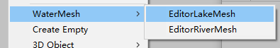

# LakeRiverMeshTools
一个湖面和河流Mesh的编辑工具
## 湖面


#### 编辑器：


#### 实现思路
湖面Mesh的生成比较简单，主要是编辑器下创建一些小球作为Mesh顶点，通过拖动小球达到编辑顶点位置的功能。
##### 划分三角形
然后对创建出来的小球顶点划分一下三角面，这里主要涉及一个凸多边形和凹多边形的划分，凸多边形的划分比较简单，对顶点做一个顺时针排序，然后可以把所有三角面连到其中一个顶点上，或取首尾顶点连城像拉链一样的锯齿状。对凹多边形的三角划分，我从网上查找了一些现成方案：
**感谢作者：https://www.cnblogs.com/lan-yt/p/9200621.html**   
大概做法是先将凹多边形划分成凸多边形，再按照凸多边形划分三角形。
##### 计算UV
Mesh的UV值会自动将超过1或小于0的值重新取0或1，所以UV的值是重复的，取顶点包围盒的中心作为0.5,0.5位置，上图编辑器中有一个UVRepeat参数，通过这个参数将UV的x和y轴按照与中心点的距离，等比例计算，从而避免UV拉伸的情况，并且能够实现UV的一个缩放效果。
```csharp
uvs[i] = new Vector2(0.5f + (vertices[i].x - center.x) / m_UVRepeat, 0.5f + (vertices[i].z - center.z) / m_UVRepeat);
```
UVRepeat取10的时候：

UVRepeat取20的时候：


#### 关于编辑器用法
菜单栏或Hierarchy下点击打开编辑器。




##### 关于参数：
LakeMesh：当前正在编辑Lake对象，不能通过Hierarchy拖拽修改，只能通过编辑器上的按钮选择编辑对象。
Mesh：当前正在编辑的Mesh对象，与LakeMesh对象绑定。
MeshName：Mesh的名字，保存的时候会作为文件默认名。
LockYaxis：Y轴锁定开关，默认Y轴锁定不可编辑，因为湖面一般来说应该是在同水平面的，需要编辑的时候可以去掉勾选。
ShowGizmos：显示一个网格连线的Gizmos。
CheckUV：替换当前材质球为一个查看UV的材质球。
MeshGridColor：修改Gizmos网格线的颜色。
UseRepeatUV：默认使用Repeat的UV，并通过UVRepeat的值来调节。
VerticeScale：调节顶点小球的缩放值，方便编辑用。
按钮：
RebuildMesh，按照当前编辑器参数重建Mesh，有时候通过Inspector面板修改了顶点位置，通过点击这个按钮刷新一下。
ChooseAndEditor：选中一个Mesh对象点击，将其作为编辑对象，并根据其顶点数据创建对应的顶点小球。
ChooseAllPoints：选中所有顶点小球，方便调整整体Mesh位置。
NewLake：移除当前编辑的Lake对象，然后Shift+右键 将会重新创建一个Lake对象。
DeleteVertivce：由于我没找到编辑器下监听删除GameObject的方法，所以就加了一个按钮用来删除顶点小球，选中要删除的小球，点击按钮或Shift+D 删除。
SetToBoundsCenter：将Mesh包围盒的中心点归位到Lake对象的0，0点，方便对位置。
SaveLake：弹出一个文件保存弹窗，保存Mesh文件。

##### 操作：

打开编辑器后，在Scene场景中 通过Shift+右键，创建一个新的Lake对象，有了Lake对象之后 Shift+右键创建可拖动的小球，用于编辑顶点位置。
Shift+D 用于删除小球顶点，可以选中多个小球再删除。
编辑Mesh对象的时候会额外创建一些辅助对象：

绿色的小球和Cube是用Gizmo画的，代表Mesh包围盒的左下角和右上角。
白色圆柱表示Lake对象的0，0点，白色Cube表示Mesh包围盒的中心点，白色胶囊体表示所有顶点小球的重心位置，小球的顺时针排序会依赖这个计算。
其它白色小球用来编辑拖动Mesh顶点。
##### 所有这些生成的辅助对象都被标记为HideFlags DontSave，不会随场景文件保存，当点击运行，关闭场景或关闭编辑器的时候会丢失这些对象，之后需要重新编辑的时候可以通过编辑器上的ChooseAndEditor按钮重新选中Lake对象并编辑。

啊，后面应美术要求多算了一套不依赖UVRepeat的UV，也就是将UV按照01边界展平，不重复，放在UV2里，可以通过UseRepeatUV开关控制。
```csharp
Vector3 size = m_Mesh.bounds.size;
float _uvRela = size.x > size.z ? size.x : size.z;
for(int i=0; i < count; i++)
{
    //uvs[i] = new Vector2((vertices[i].x - min.x) / size.x, (vertices[i].z - min.z) / size.z);
    uvs[i] = new Vector2(0.5f + (vertices[i].x - center.x) / m_UVRepeat, 0.5f + (vertices[i].z - center.z) / m_UVRepeat);
    uv2s[i] = new Vector2(0.5f + (vertices[i].x - center.x) / _uvRela, 0.5f + (vertices[i].z - center.z) / _uvRela);
}
if(m_UseRepeatUV)
{
    m_Mesh.uv = uvs;
    m_Mesh.uv2 = uv2s;
}
else
{
    m_Mesh.uv = uv2s;
    m_Mesh.uv2 = uvs;
}
```


## 河流

#### 编辑器


#### 实现思路
主要参考了知乎上这位大神的文章
https://zhuanlan.zhihu.com/p/141976251
大概是使用Catmull曲线构建河流的轨迹线，通过拖拽轨迹线关键点小球编辑曲线，然后根据轨迹线按照河流宽度创建Mesh顶点，再将顶点连成三角面，并计算UV。
Catmull曲线可以创建出穿过关键点的曲线，正好适合用来做这种轨迹线，不过这里使用贝塞尔曲线也是可以实现的。
这里主要有一个问题是，因为河道是有宽度的，随意拖拽轨迹线关键点的时候可能会出现转角过大导致河道顶点重叠，造成三角面重叠。针对这个问题我一开始考虑将重叠的顶点合并，但是不能很好的处理一些极端情况，就交叉的情况仍然还是会出现，后来考虑在生成河道顶点的时候，将转弯处的河道顶点做一个渐变插值，相当于把原本垂直于轨迹线的河道两边连线，改成向转弯方向扩散，然后删除掉仍会交叉的顶点，保留拐角处不交叉的顶点，得到一个还不错的效果。

#### 计算UV
UV的计算还是像湖面一样，设置一个UVRepeat值，以河道中心线为0.5，根据河道长度和宽度累计重复计算，并通过UVRepeat控制UV缩放。
```csharp
_curLength += Vector3.Distance(_resultWayPoints[i - 1], _resultWayPoints[i]); 
_curUVRate = _curLength / m_UVRepeat;
 if (m_Horizontal)
 {
     uv.x = _curUVRate;
     uv.y = 0.5f - _halfRiverWidth / m_UVRepeat;     
 }
 else
 {
     uv.x = _halfRiverWidth / m_UVRepeat + 0.5f;
     uv.y = _curUVRate;
 }
```
##### UVRepeat取10：

##### UVRepeat取20：


#### 关于重复编辑
因为河流Mesh不像湖面可以直接编辑顶点，河流Mesh编辑的是轨迹曲线的关键点，而这些点只在编辑的时候用到，编辑完了之后Mesh上并不会保留这些数据，所以后续想要重新编辑的话，就得要把这些轨迹线数据，包括还有一些河流宽度，流向，精度，网格数等数据全部与Mesh文件对应生成一份配置文件，需要编辑的时候加载这些配置文件，创建编辑需要的关键点，编辑器数据等。
```csharp
public class RiverCfgJson
{
    public bool horizontal = true;
    public bool useUVRepeat = false;
    public float uvRepeat = 10;
    public int perGridNum = 1;
    public float smoothNess = 0.01f;
    public int smoothAmount = 10;
    public Vector3[] wayPoints;
    public float[] wayPointsWidth;
}
```
使用Json文件保存这些配置数据，存储在Editor目录下，由于Unity本身有解析Json的库，所以用起来还比较方便。

此处我另外创建了一份tempRiver.json文件，用于保存当前正在编辑的River数据，因为一般是编辑完成，保存Mesh的时候才会存储一份配置文件，而当前正在编辑的River数据有可能会由于运行，编辑器关闭等原因丢失编辑数据，所以在一些关键操作，拖动轨迹线，修改宽度，精度，网格数等操作的时候，会自动将数据保存到tempRiver.json，可以通过加载这个tempRiver找回当前正在编辑的River。

#### 编辑器使用：
菜单栏或Hierarchy下点击打开编辑器。


##### 关于参数：
一些参数与湖面编辑器相同，就不写了。
Horizontal：控制河流的流向，横向或者纵向
Vertical：河流的流向需要保证Shader里计算的时候是从uv x的0到1 或者 y的0到1， x 0到1则是横向流的，y轴0到1则是纵向流的。
DefaultWidth：河流的默认宽度，每添加一个轨迹曲线关键点，按照这个默认宽度计算出河道两边顶点的位置。
PointWidth：选中曲线上的关键点的时候，可以修改此处河道的宽度，而该点前后关键点之间的宽度通过插值计算。
PerGridNum：控制河道宽度上构成的网格数量，有时候河道转角过大会造成UV拉伸，增加网格数可以使UV更平滑，
SmoothNess：用于曲线上转角角度相差不大的点，减少每两个关键点之间的网格数量，该值越小，精度越高。
SmoothAmount：控制每两个关键点之间的平滑点数量，控制曲线的平滑度。

按钮：
ChooseRiver：选中一个想要编辑的River对象。
LoadTemp：选中一个想要编辑的River对象，并加载tempRiver中的配置，用于找回刚刚编辑的River数据。
LoadConfig：弹出一个文件选择框，加载保存过的配置文件。
SaveConfig：根据MeshName保存一个同名的配置文件到Editor目录，由于这些配置文件只在编辑器下才会用到，所以就写死了存储目录。

操作：

与LakeMesh一样，编辑过程中也会创建一些辅助对象，

这个圆柱表示River对象的000位置。
这些辅助对象与轨迹线上编辑用的小球也都设置为DontSave，编辑过程中可能会丢失这些对象，通过加载tempRiver.json找回重新编辑。
